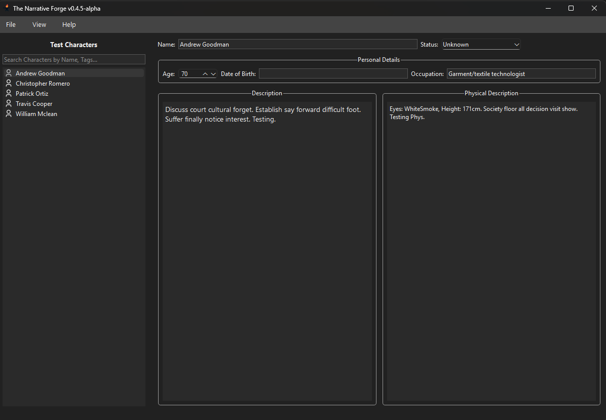
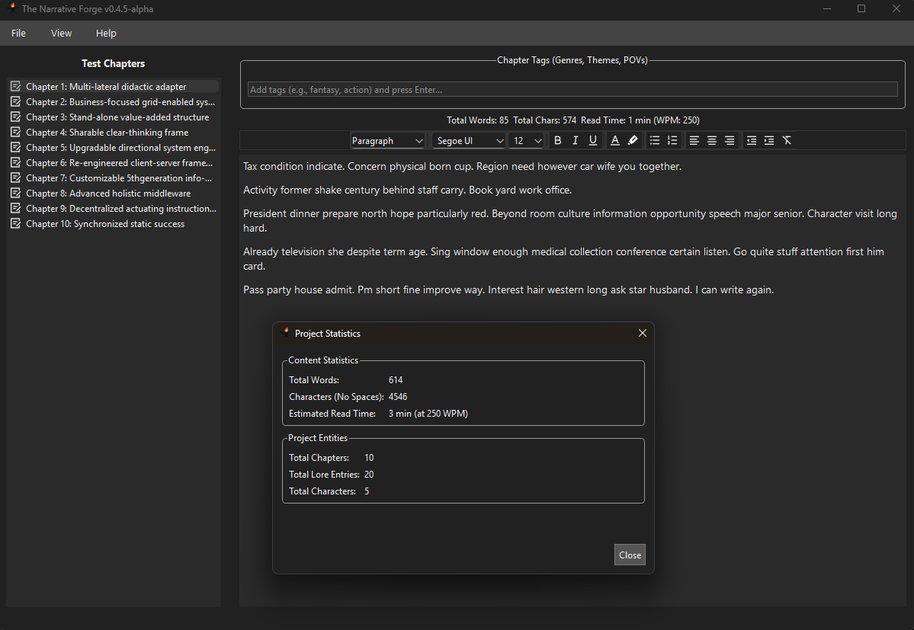

# **✍️ Narrative Forge**

Narrative Forge is a comprehensive desktop application designed to assist **authors, storytellers, and worldbuilders** in organizing and developing their fictional universes. Built using **Python** and **PySide6**, it provides dedicated tools for managing chapters, characters, lore, and the relationships between them.



## **✨ Key Features**

The application provides specialized views and editors to manage all aspects of your story:

- **Chapter Management:** Outline and edit chapters.  
  - **Chapter Statistics:** The **Chapter Editor** displays real-time statistics for the active chapter, with an additional global statistics dialog for the entire story.



- **Character Profiles:** Create and manage detailed character profiles and biographies.  
- **Lore/Worldbuilding Editor:** Document and organize your world's history, locations, and other lore elements.  
- **Relationship Graph:** Visualize character connections through a dynamic node graph.  
  - **Custom Relationships:** Define custom RelationshipTypes and adjust relationship intensity.  
  - **High-Performance Layout:** Utilizes a custom **C++ library** implementing the **Fruchterman-Reingold** force-directed algorithm for the "Auto Layout" feature.  
  - **Precision Tools:** Toggleable background grid and "Snap to Grid" functionality for manual node organization.


- **Tagging System:** Apply tags to various entities for easy organization and filtering.  
- **Inter-Entry Lookup:** While editing a chapter, highlight text and press **Ctrl+Shift+L** to instantly view associated character or lore entries.  
- **Data Export:** Export your story data into shareable formats like Markdown or plain text.

## **Individual Project Folders**

Each user project is self-contained:

\[ProjectName\]/  
├── \[ProjectName\].db         \# SQLite Database  
├── config/                  \# Project-specific settings (.nfp)  
├── assets/                  \# Images and local media  
└── exports/                 \# Generated documents

## 🐛 Reporting Bugs & Issues

Narrative Forge is under active development. If you encounter a bug or have a feature request, please help us improve by following these steps:

1. **Check the Roadmap:** See [docs/maintenance/TODO.md](docs/maintenance/TODO.md) to see if the issue is already being tracked.

    - Check the issue Tracker to ensure the bug has not already been reported.

2. **Open an Issue:** Use the GitHub Issue Tracker to report the bug. Please include:

    - A clear description of the bug.
  
    - Steps to reproduce the behavior.
  
    - Your environment details (OS, Python version if development bug).
  
    - Screenshots or logs from the `logs/` directory.

## Development

### **🛠️ Requirements**

- **Python:** 3.14.0  
- **GUI Framework:** PySide6 6.10.1  
- **Build Tools:** C++ compiler (for core library optimization)

### **💾 Project Structure**

Narrative Forge follows a modular architecture separating the GUI, business logic, and high-performance core:

narrative-forge/  
├── src/  
│   ├── c\_lib/          \# C++ Core (Graph layout & Text stats engines)  
│   ├── python/  
│   │   ├── repository/ \# Data access layer (SQLite)  
│   │   ├── services/   \# Business logic & Exporters  
│   │   ├── ui/         \# PySide6 Windows, Widgets, Menu and Dialogs  
│   │   └── utils/      \# Custom UI components (Graph, Text Editors)  
│   └── sql/            \# Database schema migrations  
├── tools/              \# Developer utility scripts  
├── styles/             \# QSS Theme files  
└── docs/               \# Technical documentation & ERDs  
└── tools/              \# Helpful Development Tools

### **🧪 Testing**

The project uses pytest for unit and integration testing of the repositories and database connectors.

To run the tests:

```Bash
python -m pytest
```

### **Documentation**

Technical specifications and project guides are maintained in the docs/ directory using a "Documentation-as-Code" approach.

#### Core Technical Specs

-[Coding Standards](docs/development/STYLE_GUIDE.md): The Style Guide for Contributing Code.

-[Database Schema](docs/development/architecture/SCHEMA.md): Detailed breakdown of SQLite tables, constraints, and performance indexes.

-[C++ Bridge API](docs/development/architecture/CPP_BRIDGE.md): Reference for the cffi layer, memory management, and C-API exports.

-[Project Standards](docs/development/project-structure/NarrativeForgeProjectFolder.md): Specifications for the .nforge portable project directory.

#### Algorithms & Logic

-[Fruchterman-Reingold](docs/development/algorithms/fruchterman-reingold.md): Deep-dive into the modified force-directed layout engine used for relationship graphs.

#### Project Management

-[Roadmap & TODO](docs/maintenance/TODO.md): Tracking upcoming features like the C++ Delta Engine and Entity Discovery.

**Build Documentation** (Sphinx):

```Bash
python tools/build_docs.py
```

**View Documentation**:

```Bash
python tools/view_docs.py
```

## **🚀 Run**

### **Installation**

1. **Clone the Repository.**  
2. **Install Dependencies:**

```Bash
pip install -r requirements.txt
```

3. Build C++ Core (Required for Auto-Layout):  
   Compile the source in src/c\_lib/ into nf\_core\_lib.dll or .so.

### **Execution**

Run the application directly from the main module:

```Bash
python -m src.python.main
```

## **📄 License**

This project is licensed under the MIT License \- see the [LICENSE](LICENSE) file for details.

### Project Logo (`resources/logo.ico`)

**License:** All Rights Reserved / Proprietary
The Narrative Forge logo is the intellectual property of the maintainers. 

- Personal Use: You may use the logo for personal use while running the software. 

- Contributions: You may include the logo in forks of this repository specifically for the purpose of developing and submitting Pull Requests to the main project. 

- Restrictions: You may not use this logo for separate commercial purposes or in unrelated derivative works (independent forks/rebrands) without express permission. 

###  Icons (`resources/icons/`)

**License:** Apache License 2.0
All icons in this directory are sourced from [Remix Icon](https://remixicon.com/).

* **Modifications:** Some filenames have been changed from the original Remix Icon set to better match the Narrative Forge project naming conventions.

- **Restrictions:** Per the Remix Icon license, these icons may not be sold individually or as an icon pack.
- See [`resources/icons/LICENSE`](resources/icons/LICENSE) for the full Apache 2.0 text.

## 🤝 Contributing

Please review our [Code of Condcut](CODE_OF_CONDUCT.md) and the [Style Guide](docs/development/STYLE_GUIDE.md) 
before submitting a Pull Request.
