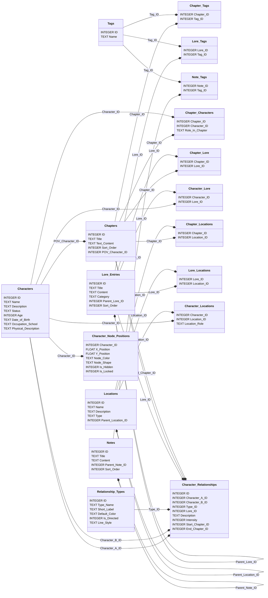

# Database Schema Diagram

*Generated automatically from src/sql/schema_v1.sql*

```mermaid
classDiagram
    direction LR
    class Chapters {
        INTEGER ID
        TEXT Title
        TEXT Text_Content
        INTEGER Sort_Order
        INTEGER POV_Character_ID
    }
    class Lore_Entries {
        INTEGER ID
        TEXT Title
        TEXT Content
        TEXT Category
        INTEGER Parent_Lore_ID
        INTEGER Sort_Order
    }
    class Characters {
        INTEGER ID
        TEXT Name
        TEXT Description
        TEXT Status
        INTEGER Age
        TEXT Date_of_Birth
        TEXT Occupation_School
        TEXT Physical_Description
    }
    class Locations {
        INTEGER ID
        TEXT Name
        TEXT Description
        TEXT Type
        INTEGER Parent_Location_ID
    }
    class Notes {
        INTEGER ID
        TEXT Title
        TEXT Content
        INTEGER Parent_Note_ID
        INTEGER Sort_Order
    }
    class Tags {
        INTEGER ID
        TEXT Name
    }
    class Chapter_Tags {
        INTEGER Chapter_ID
        INTEGER Tag_ID
    }
    class Lore_Tags {
        INTEGER Lore_ID
        INTEGER Tag_ID
    }
    class Note_Tags {
        INTEGER Note_ID
        INTEGER Tag_ID
    }
    class Chapter_Characters {
        INTEGER Chapter_ID
        INTEGER Character_ID
        TEXT Role_In_Chapter
    }
    class Chapter_Lore {
        INTEGER Chapter_ID
        INTEGER Lore_ID
    }
    class Character_Lore {
        INTEGER Character_ID
        INTEGER Lore_ID
    }
    class Chapter_Locations {
        INTEGER Chapter_ID
        INTEGER Location_ID
    }
    class Lore_Locations {
        INTEGER Lore_ID
        INTEGER Location_ID
    }
    class Character_Locations {
        INTEGER Character_ID
        INTEGER Location_ID
        TEXT Location_Role
    }
    class Relationship_Types {
        INTEGER ID
        TEXT Type_Name
        TEXT Short_Label
        TEXT Default_Color
        INTEGER Is_Directed
        TEXT Line_Style
    }
    class Character_Relationships {
        INTEGER ID
        INTEGER Character_A_ID
        INTEGER Character_B_ID
        INTEGER Type_ID
        INTEGER Lore_ID
        TEXT Description
        INTEGER Intensity
        INTEGER Start_Chapter_ID
        INTEGER End_Chapter_ID
    }
    class Character_Node_Positions {
        INTEGER Character_ID
        FLOAT X_Position
        FLOAT Y_Position
        TEXT Node_Color
        TEXT Node_Shape
        INTEGER Is_Hidden
        INTEGER Is_Locked
    }
    Characters --* Chapters : POV_Character_ID
    Lore_Entries --* Lore_Entries : Parent_Lore_ID
    Locations --* Locations : Parent_Location_ID
    Notes --* Notes : Parent_Note_ID
    Chapters --* Chapter_Tags : Chapter_ID
    Tags --* Chapter_Tags : Tag_ID
    Lore_Entries --* Lore_Tags : Lore_ID
    Tags --* Lore_Tags : Tag_ID
    Notes --* Note_Tags : Note_ID
    Tags --* Note_Tags : Tag_ID
    Chapters --* Chapter_Characters : Chapter_ID
    Characters --* Chapter_Characters : Character_ID
    Chapters --* Chapter_Lore : Chapter_ID
    Lore_Entries --* Chapter_Lore : Lore_ID
    Characters --* Character_Lore : Character_ID
    Lore_Entries --* Character_Lore : Lore_ID
    Chapters --* Chapter_Locations : Chapter_ID
    Locations --* Chapter_Locations : Location_ID
    Lore_Entries --* Lore_Locations : Lore_ID
    Locations --* Lore_Locations : Location_ID
    Characters --* Character_Locations : Character_ID
    Locations --* Character_Locations : Location_ID
    Characters --* Character_Relationships : Character_A_ID
    Characters --* Character_Relationships : Character_B_ID
    Relationship_Types --* Character_Relationships : Type_ID
    Lore_Entries --* Character_Relationships : Lore_ID
    Chapters --* Character_Relationships : Start_Chapter_ID
    Chapters --* Character_Relationships : End_Chapter_ID
    Characters --* Character_Node_Positions : Character_ID
```
