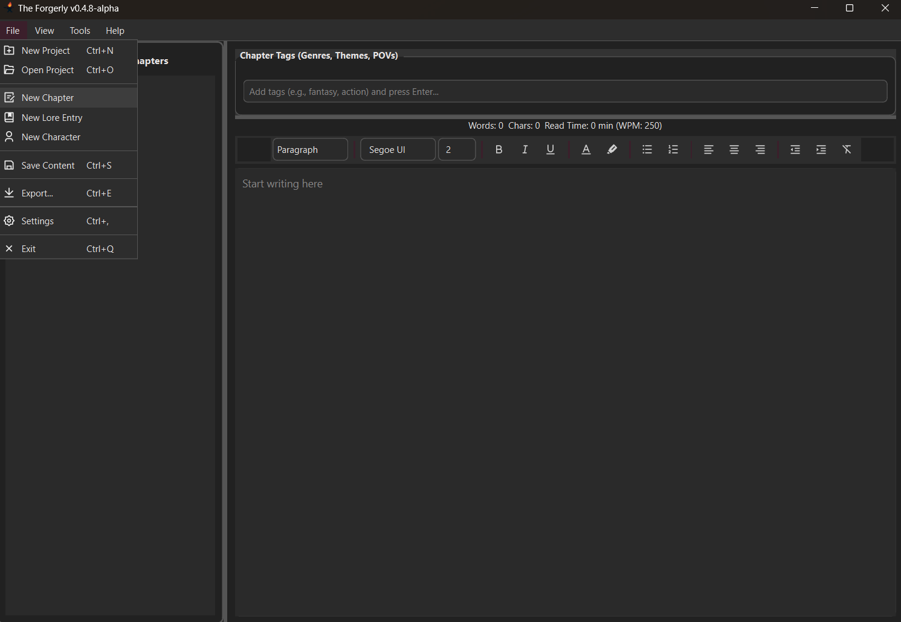
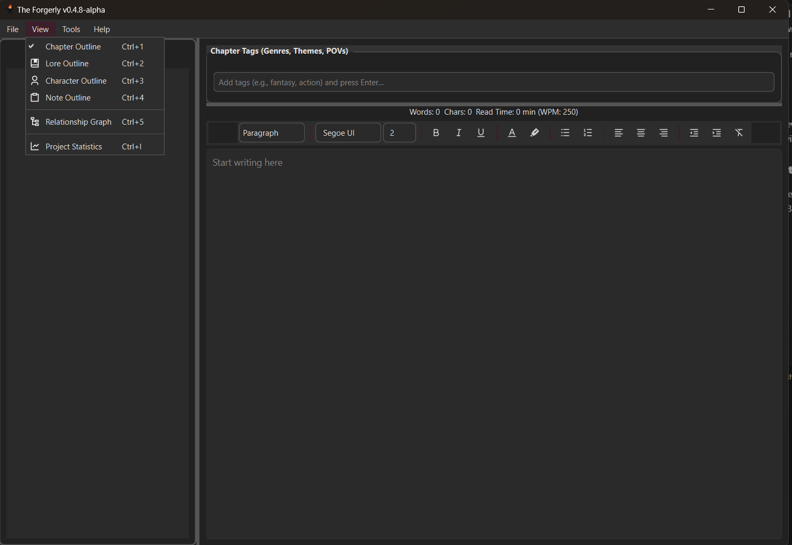
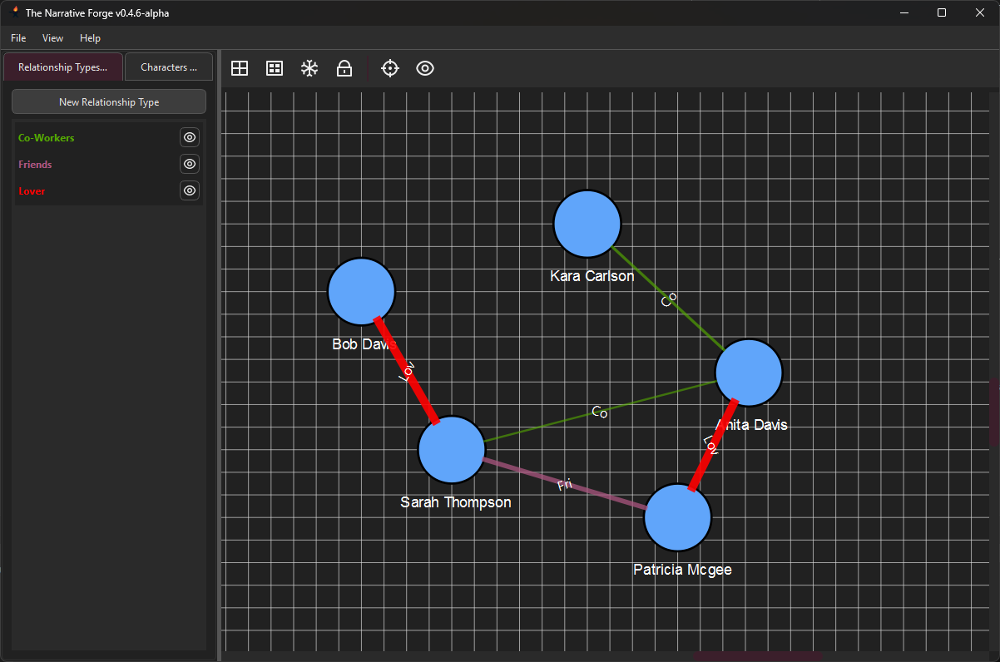
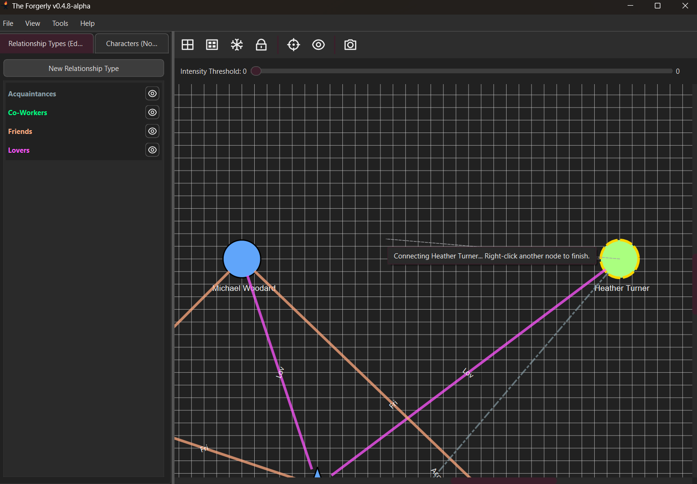

# **User Guide**

Learn how to use Forgerly with this User Guide

## Table of Contents

- **[First Steps](#first-steps)**
    - [Creating First Project](#creating-your-first-project)
    - [Creating First Chapter](#creating-your-first-chapter)
    - [Switching the View](#switching-the-view)
    - [Creating Your First Lore Entry, Character, or Note](#creating-your-first-lore-entry-character-or-note)

- **[Chapter Editor](#chapter-editor)**

- **[Lore Entry Editor](#lore-entry-editor)**

- **[Character Editor](#character-editor)**

- **[Note Editor](#note-editor)**

- **[Relationship Graph](#relationship-graph)**
    - [Create A Relationship Type](#create-a-relationship-type)
    - [Assign a Relationship to Two Characters](#assign-a-relationship-to-two-characters)
    - [Character Nodes](#character-nodes)
    - [Relationship Edges](#relationship-edges)
    - [Relationship Graph Tool Bar](#relationship-graph-tool-bar)

- **[Project Statistics](#project-statistics)**

- **[Exporting](#exporting)**

- **[Menu Bar](#menu-bar)**

- **[Shortcuts](#shortcuts)**

## **First Steps**

### **Creating Your First Project**

When first launching the Forgerly Application you will come across this screen.

Click Create Project. Select the Folder you would like the Forgerly Project to be in. 
Enter Name of Project and Click Ok or Press Enter. Congratulations, You Created your first Forgerly Project.

### **Creating Your First Chapter**

To Create your first Chapter, Click on File Button in the Menu Bar. 

Enter the Name of the Chapter, and Click Ok. You will see your chapter Appear in the Outline on the Left and
you can start writing your story.

You can also right click on the Outline at any time to rename the Chapter, Delete the Chapter, or Add a new Chapter.

### **Switching the View**

You can switch the View from the default Chapter View to Lore View, Character View, or Note View. To Switch the view navigate and Click on the View Button in the Menu Bar.

Switching the View allows you to view your other entities and see Project Statistics.

### **Creating Your First Lore Entry, Character, or Note**

Creating a Lore Entry, Character and Note is the same
as creating a new Chapter. Navigate to the File Button or in the Menu Bar or Switch to their view and right click on their outlines.

## **Chapter Editor**

The Chapter Editor is the Default Editor. It is where you can write and forge your story. You may Create, Delete and Reorder Chapters using the outline on the Left.

When you click on a Chapter in the outline in it will appear in the editor on the right. You may use all the Rich Text Features you like when writing your chapter.

You can Tag your Chapter. Using Tags allows you to set a Tag and search for such Tags to find Chapters. You can add Tags to easily see what a Chapter is about, POV or whatever you like.

When editing a chapter and you forget details about a Character or Lore Entry, you can highlight the text and go to Tools -> Lookup Text and it will bring a Dialog Window showing that Entity and its description. This empowers your writing, preventing long look up times.

For Exporting, your chapter see [Exporting](#exporting)

## **Lore Entry Editor**

The Lore Entry Editor is where you can write and forge lore entries. You may Create, Delete, Reorder, and event next Lore Entries under other Lore Entries.

When you click on a Lore Entry in the outline in it will appear in the editor on the right. You can write your Lore Entry, Add it to a Category or event add Tags.

You can use the search bar at the top of the outline to search for Lore Entrys by Title, Category, or Tag.

You can Tag your Lore Entry. Using Tags allows you to set a Tag and search for such Tags to find Lore Entries. You can add Tags to easily see what a Lore Entry is about, POV or whatever you like.

For Exporting, your lore entry see [Exporting](#exporting)

## **Character Editor**

The Character Editor is where you can write and edit Characters for your story. You may Create or Delete Characters on the outline.

When you click on a Character in the outline in it will appear in the editor on the right. You can write all sorts of things for your Character: description, physical descriptuon, age, occupation, status or tags.

You can use the search bar at the top of the outline to search for Characters by Name or Tag.

You can Tag your Character. Using Tags allows you to set a Tag and search for such Tags to find Characters. You can add Tags to easily see what a Character is about or whatever you like.

For Exporting, your Character see [Exporting](#exporting)

## **Note Editor**

The Note Editor is an editor that allows to write notes.
 Notes are basically whatever you want for your project.

 The Note Editor operates the same as the Chapter Editor.

 You can use it to write an outline or write out ideas.

 There is currently no way to export notes.

## **Relationship Graph**

The Relationship Graph allows you to view your Characters
and their relationships to other Characters.

First, You want to ensure you have created Characters. To Learn how to Create a Character, See [Creating a Character](#creating-your-first-lore-entry-character-or-note).

### Create a Relationship Type

You Can Create a New Relationship Type by Clicking the Button New Relationship Type. Select the Styling you would like for that Relationship Type and Click Ok.

### Assign a Relationship To Two Characters

To Assign a Relationship to Two Characters right click on first node and select "Connect to Character" on the Context Menu. You will know the Character is selected because the Character will appear with a Yellow Highlight like in the Image below.

To Finish Assigning a Relationship, Right Click on the Next Code and select "Connect to Character".

A Dialog Window will appear allowing you to determine the parameters of the Relationship.
The Intensity Parameter determines the Thickness of the Line on the Relationship Graph.

### Character Nodes

The Character Nodes are the Nodes on the Graph.

You can edit a node by right clicking on one and selecting the edit node option. This allows you to custom their color, shape, visbility, lock status.

Character Nodes are the basis of the Graph.

### Relationship Edges

The Relationship Edges are edges or relationships that connect to Character Nodes together.

You can edit a relationship by right clicking on the relationship and selecting edit relationship. You can edit the relationship type, description, and intensity.
See [Edit Relationship Type](#create-a-relationship-type) to edit and create a relationship type.

### Relationship Graph Tool Bar

There are Several Buttons on the Tool Bar to help you build your perfect Graph.

#### Toggle Grid

This Buttons Toggles On/Off the Grid in the Background. Default is On.

#### Toggle Snap to Grid

This Button Toggles the Snap to Grid when moving Characters around on the Graph. Default is On.

#### Auto Layout

This button triggers the Auto Layout. The Auto Layout uses the Fruchterman-Reingold Algorithm to Place you Characters in the prettiest way possible. Will not apply to Characters that are Locked.

#### Lock All Nodes

This button locks all nodes. This means that if the Auto Layout Button is pressed, the Characters will not move. This does not stop manually moving the Characters around.

#### Reset Zoom

This button Resets the Zoom to where all nodes are Visible.

#### Toggle Label Visibility

This button Toggles whether or not you are able to see the Short Labels visible on the Graph.

#### Screenshot

This button opens a Dialog with options to tag the perfect Screenshot of your Graph.

## **Project Statistics**

The Project Statistics is a Dialog Window that you can acess by going to View -> Project Statistics. This Window displays many of the statstics for your project.

## **Exporting**

You are able to export Chapters, Lore Entries, Characters. You can export all of them or none of them.

Export Types: HTML, Markdown, Plaint Text, EPUB, PDF, JSON, YAML.
